# HangMan Game

## Introduction

Welcome to Hangman, a classic word-guessing game where you try to uncover a hidden word letter by letter. 
This console-based Hangman game is a simple yet entertaining way to challenge your vocabulary.

## How to play:

1. Run the script in a Python environment.
2. Enter your name to start the game.
3. Guess letters to uncover the hidden word.
4. Be mindful of incorrect guesses, represented by the hangman's progression.
5. Win by guessing the entire word or lose if the hangman is fully drawn.

## Logic and Planning

Before diving into the world of Hangman, let's explore the meticulous planning and logical structure that lay the foundation for this captivating game.

Game Flowchart
To ensure a seamless and engaging experience, a comprehensive flowchart was meticulously crafted. This visual representation outlines the game's decision-making process, from the player's entry to the triumphant victory or unfortunate defeat.

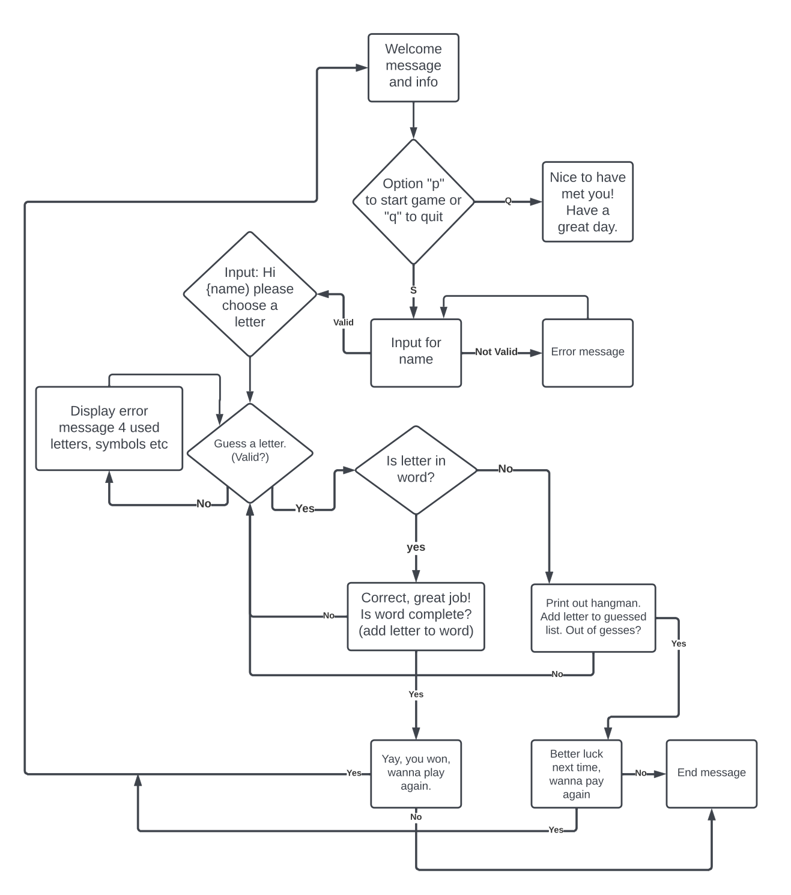

Code Architecture
The game's logic is elegantly structured to handle player inputs, track guessed letters, and manage the progression of the hangman's fate. Each decision point in the game is thoughtfully orchestrated, providing an immersive and intuitive gameplay flow.

Random Word Selection
The heart of Hangman lies in its words. A carefully curated list of diverse and intriguing words ensures that each game is a unique challenge. The logic for selecting a random word is designed to keep players on their toes, ready to unravel the mystery.

User Interaction
User interaction is a key focus. The game prompts players for their name, guides them through the rules, and allows them to make guesses. The code is crafted to handle various scenarios, ensuring a user-friendly and enjoyable experience.

Error Handling
To enhance robustness, the code incorporates error handling. Whether a player enters an invalid name, guesses a previously guessed letter, or inputs a non-alphabetic character, the game responds gracefully, guiding the player back on track.

In essence, the logic and planning behind the Hangman game aim to deliver not just a game but an immersive journey into the realm of words and wit. With every line of code, thoughtful consideration has been given to create an experience that is both challenging and enjoyable. May your exploration of Hangman be filled with suspense, triumphs, and the occasional unraveling of mysteries!

## Features

- **Interactive Gameplay:**     Guess letters to reveal the hidden word.
- **Random Word Selection:**    Each game features a randomly selected word from a predefined list.
- **Hangman ASCII Art:**        Enjoy visual representations of the hangman's progress based on incorrect guesses.
- **Player-Friendly:**          User prompts and feedback make the game easy to understand and play.
- **Play Again Option:**        Decide whether to start a new game or exit after completing a round.
- **Input Validation:**         Ensure that player inputs meet the game's requirements.

### Existing Features

Start Screen:

- When the console is launched, the Hangman ASCII art appears along with the game rules. The player is prompted to choose between starting a new game or quitting to exit the game.

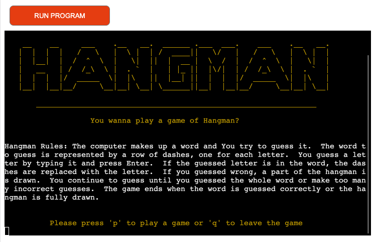

Input Name:

- The game welcomes the player with a prompt to enter their name, adding a personalized touch to the gaming experience. This step ensures a unique and engaging connection with the player before diving into the challenges of Hangman. The input requires a minimum of two letters for validation. 

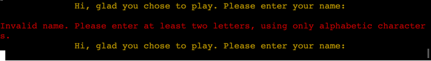

Letter Input:

- In this interactive phase, the player is prompted to guess a letter for the Hangman game. The console awaits the player's input, creating an immersive experience as they strategically select a letter they believe is part of the hidden word. This step is crucial for progressing through the game and adds an element of suspense and strategy to the overall gameplay.

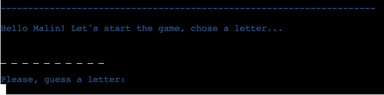

Correct Choice of Letter:

- In this victorious moment, the player has successfully guessed a letter that is part of the secret word. The console responds with a positive acknowledgment, updating the display to reveal the correct placement of the guessed letter(s) within the word. This progress brings the player closer to unraveling the complete word and adds a sense of accomplishment to the gaming experience.

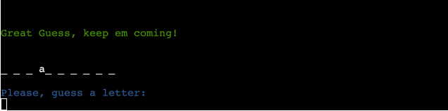

Wrong Choice of Letter:

- Uh-oh! The player has made an incorrect guess, and the consequences are unfolding. The console responds by updating the Hangman display, illustrating a part of the Hangman figure. Additionally, a list of incorrect guesses is presented, urging the player to strategize and make more accurate choices in subsequent attempts. The challenge intensifies, adding suspense to the game.

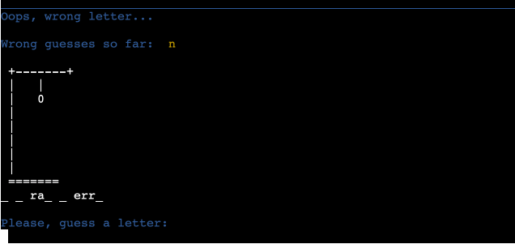

Invalid Input:

- The player encounters a hurdle in the game journey. Upon attempting to input a letter, an error message appears on the console. The message notifies the player of an invalid entry, prompting them to reevaluate and adhere to the game's rules. Clear instructions guide the player to input a single alphabetical character, fostering a fair and engaging gaming experience.

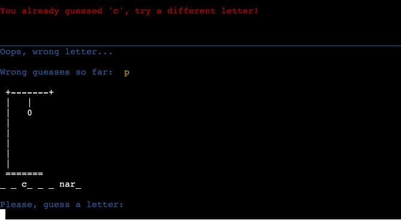

The Winner Takes It All:

- The climax of triumph unfolds on the screen as the player successfully guesses the entire word, emerging as the Hangman victor. The console beams with congratulations, revealing the concealed word in its entirety. A vibrant display of celebratory messages acknowledges the player's skillful deduction and brings the gaming journey to a satisfying conclusion.

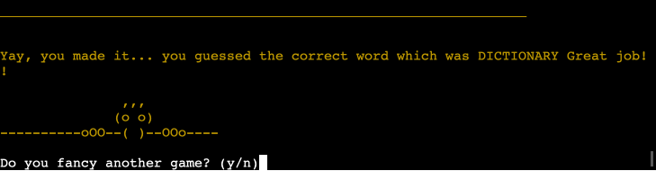

The Looser Standing Small:

- Oh no! The gallows stand complete, the hangman is fully drawn. Darkness descends as the correct word eludes you. The echoes of defeat reverberate through the silence. But fear not, for another challenge awaits. Will you rise from the ashes and conquer the next round?

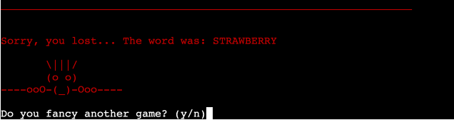

Should I Stay or Should I Go:

- As you choose to depart, the hangman's shadow lingers. A choice made to step away from the enigmatic challenge. Until we meet again, the lingering mysteries remain unsolved. Until next time, brave soul. May your adventures be many.

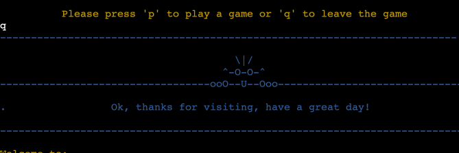

## Technologies Used

- Python

## Frameworks, Libraries, Modules & Programs Used

- Github
  - Deployment of the website and storing the files online.
- Am I Responsive
  - Mockup picture for the README file.
- Codeanywhere
  - To write the code.
- Python
  - Time, sleep module to delay text print-out.
  - Colorama, for different colors on text and ascii
  - Random, for a random choice in word list
- Heroku
  - For creating the console and deploying the project.
- Lucidchart
  - Used to create the flowchart
- Patorjk
  - Was used to draw the game logo (ASCII Art Generator)

## Testing

Lighthouse

Lighthouse was used to test Performance

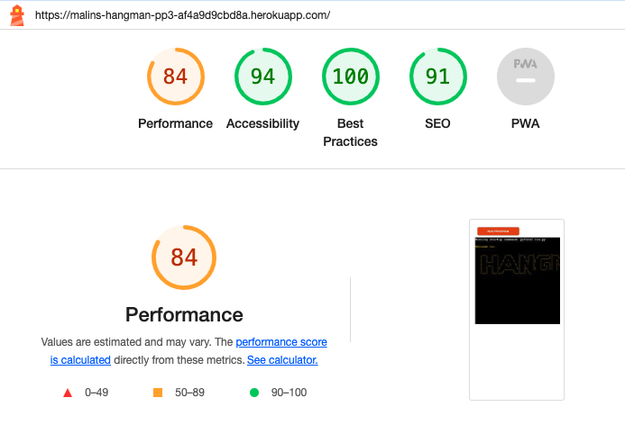

Manual Testing

## Deployment

Deploying and Interacting with this Project

Deploying on Heroku

This project was deployed on Heroku by completing the following steps:
* Log in to Heroku or create a new account.
* On the main page, click the "New" button in the top right corner, and from the drop-down menu, select "Create New App."
* Enter a unique app name and select your desired region.
* Click the "Create App" button.
* In the project’s Deploy Tab, navigate to the Settings Tab, scroll down to Config Vars.
* Click "Reveal Config Vars," enter "port" into the Key box, "8000" into the Value box, and click the "Add" button.
* Repeat step 6, adding "CREDS" into the Key box and the Google credentials into the Value box.
* Scroll down to the Buildpack section, click "Add Buildpack," select "python," and click "Save Changes."
* Repeat step 8 to add "node.js." Note: Ensure the Buildpacks are in the correct order; if not, click and drag them into the correct sequence.
* Navigate to the Deploy tab, select "GitHub" as the deployment method, confirm the connection to GitHub, and search for the repository name. Click the "connect" button.
* Scroll to the bottom of the deploy page and choose the preferred deployment type.
* Click either "Enable Automatic Deploys" for automatic deployment when pushing updates to GitHub.

Forking This Project

Forking this project, follow these simple steps:
* Open GitHub.
* Click on the project you wish to fork.
* Locate the "Fork" button at the top right of the page.
* Click the "Fork" button, and the project will be added to your repository.

Cloning This Project

Clone this project using these steps:
* Open GitHub.
* Click on the project you want to clone.
* You will be provided with three options: HTTPS, SSH, or GitHub CLI. Click the clipboard icon to copy the URL.
* Open a new terminal.
* Change the current working directory to your desired location.
* Type git clone and paste the URL copied in step 3.
* Press Enter, and voila, the project is cloned and ready for exploration!

The live link to HangMan: https://malins-hangman-pp3-af4a9d9cbd8a.herokuapp.com/ 

## Credits

Code

- Understanding the concept of Python has been a challenging task and I found a lot of help in freeCodeCamp as well as in Bro Codes YouTube channel.
- The README template was helpfully provided by Code Institute (template) as was the main template.
- Using PyNative as a tool was extremely helpful.
- Slack has been a good platform for inputs and ideas.
- ChatGPT has also been a resource for explaining things to me as a newbie.

Content

- All the text was written by the developer with a little help from ChatGPT.

ASCII are taken from:
- patorjk.com
- asciiart.eu 

## Acknowledgements

- Slack community has been a great resource for help and ideas.
- My mentor Mitko Bachvarov has provided me with good links to helpful websites and gently guided me with good feedback.
- freeCodeCamp, thank you for your page and course, it was a great help.
- Bro Code, keep em coming. 
- ChatGPT, thanks for the tuition, laughs and correction of text.
- Anna, my inspiration and support. Thank you.

